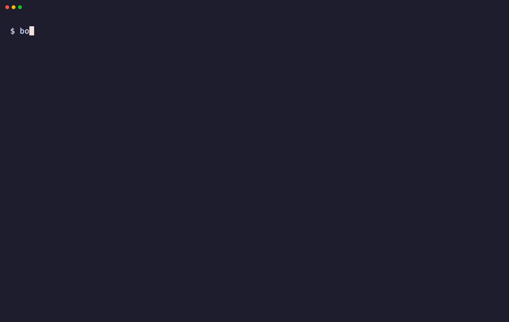

# BoringBuilder

[](https://github.com/boringcache/builder/actions/workflows/ci.yml)

BoringBuilder turns application source into deployable artifacts and container images with
[Dagger](https://dagger.io). Rails is the first-class path, and every application can use the same
[Mise-powered](https://mise.jdx.dev/) toolchain from a small
[Dagger Ruby](https://github.com/boringcache/dagger_ruby) recipe. Local builds use Dagger's cache; shared builds use
[BoringCache](https://boringcache.com) without changing the recipe.



## Getting started

BoringBuilder itself runs on Ruby, but the application being built does not need to. Dagger runs through
[Apple Container](https://docs.dagger.io/reference/container-runtimes/apple-container/) on supported Macs,
Docker on Linux or macOS, or an existing Dagger engine on a Linux VM.

Install the builder and run it from an application root:

```sh
gem install boringbuilder --version "~> 0.1.0.alpha"
boringbuilder doctor
boringbuilder build
```

Rails and other Ruby applications can keep the builder in their bundle:

```sh
bundle add boringbuilder --version "~> 0.1.0.alpha"
bundle exec boringbuilder build
```

The default build produces a zstd-compressed artifact with normalized archive metadata. Without shared credentials
it is written under `dist/`. BoringBuilder automatically:

1. loads `config/boringbuilder.rb` when present;
2. runs its custom Dagger Ruby recipe for any application; or
3. uses the built-in Mise-powered Ruby pipeline when a `Gemfile` is present.

The built-in pipeline reads the Ruby toolchain from `mise.toml`, `.mise.toml`, `.tool-versions`, `.ruby-version`, or
`Gemfile`, then `Gemfile.lock`. It installs the selected toolchain with Mise inside the Dagger build. Generated
recipes use that same foundation for Node, Rust, Go, or any other tool available through Mise.

A root `Gemfile` identifies a Ruby application. Rails receives asset, Bootsnap, entrypoint, and `/up` health-check
conventions. Hanami, Rack, and `Procfile` applications receive production commands without pretending to be Rails.

Non-Ruby applications provide the few commands that make their build distinctive; BoringBuilder does not guess a
package manager or production output. Generate a detected Node, Rust, Go, Ruby, or generic starting point when
needed:

```sh
boringbuilder init
boringbuilder build
```

The generated Ruby stays small: `pipeline.mise` prepares the tools and source, while `pipeline.run` persists declared
dependency caches locally or through BoringCache. Builds print clean, numbered application steps while Dagger's
internal graph stays out of the way.

See [Building applications](docs/building.md) for the generated recipes and the complete pipeline API.

Command-line options remain explicit overrides:

```sh
boringbuilder build --runtime apple
boringbuilder build --runtime docker --platform linux/arm64
```

Rails applications can also use the included task:

```sh
bin/rails boringbuilder:build
```

## Caching

Every build uses the selected Dagger engine's local cache. When BoringCache credentials and a workspace are present,
shared BoringCache entries replace the corresponding local mounts for Mise, Bundler, and declared custom pipeline
caches across fresh engines and CI runners.

See [Caching](docs/caching.md) for custom cached steps and restore-only builds.

## Artifacts and images

The default `tar.zst` output is intended for atomic filesystem deployers such as BoringDeploy. Without shared
credentials it is written under `dist/`. With BoringCache save credentials it is published as a shared BoringCache
Artifact instead; pass `--output` when a local copy is also wanted.

The same build can produce or publish a container image:

```sh
boringbuilder build --output dist/app.tar.zst
boringbuilder build --format oci --output dist/app.oci.tar
boringbuilder build --format docker --output dist/app.docker.tar
boringbuilder build --push ghcr.io/acme/app:latest
```

Application-specific filesystem layouts live in ordinary Ruby:

```ruby
# config/boringbuilder.rb
BoringBuilder.configure do |config|
  config.artifact.directory("/app", at: "/opt/my-app/current")
end
```

See [Artifacts and images](docs/artifacts.md) for directory selection, OCI and Docker archives, registry publishing,
and the Ruby API.

## Documentation

- [Building applications](docs/building.md)
- [Artifacts and images](docs/artifacts.md)
- [Caching](docs/caching.md)
- [Project soul](SOUL.md)
- [Code and writing style](STYLE.md)
- [Agent guide](AGENTS.md)
- [Changelog](CHANGELOG.md)
- [Contributing](CONTRIBUTING.md)
- [Security policy](SECURITY.md)

## Development

```sh
mise install
bin/setup
bin/ci
```

The checked-in toolchain is the development default. The gemspec and CI define the supported Ruby range.
